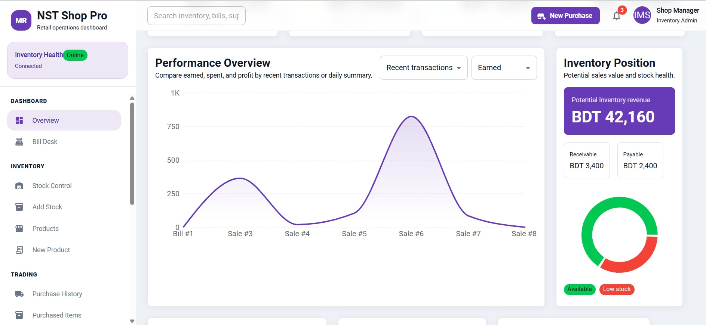

# Inventory Management System (IMS)

A web-based inventory management solution for small shops. Track products, stock levels, purchases, sales, and generate real-time analytics.

## Tech Stack

**Backend:** Django 4.1.4 + Django REST Framework  
**Frontend:** React 18 + Material-UI + Recharts  
**Database:** SQLite  
**Styling:** Tailwind CSS + Material-UI

## 🎥 Walkthrough Video


[](https://www.youtube.com/watch?v=LgKUkrJmiNQ)

## 📸 Demos

### Image 1


### Image 2


## Features

- ✅ Product management (add, update, remove)
- ✅ Real-time inventory tracking
- ✅ Purchase orders & supplier management
- ✅ Sales processing with auto-stock reduction
- ✅ Payment tracking (customer & supplier ledgers)
- ✅ Interactive dashboard with charts & analytics
- ✅ Sales & purchase reports
- ✅ Low stock alerts


## Usage

**Dashboard:** View analytics, top products, low stock items, and recent transactions

**Products:** Navigate to `Products > New Product` to add items

**Inventory:** Use `Inventory > Add Stock` to set purchase/selling prices

**Purchases:** Create supplier orders via `Trading > New Purchase`

**Sales:** Process customer bills at `Overview > Bill Desk` (auto-updates stock)

## Project Structure

```
server/          # Django API
├── account/     # User management
├── product/     # Product data
├── stock/       # Inventory tracking
├── purchase/    # Purchase orders
├── sale/        # Sales records
├── supplier/    # Supplier info

client/          # React dashboard
├── src/
│── Components/  # Dashboard, Products, Bills, etc.
└── Pages/       # Main layout & routing
```


